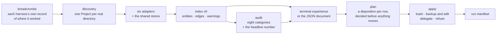

# moldig

**CleanMyMac for your AI setup.** One read-only pass over everything six AI coding harnesses left
on your machine — skills, MCP servers, context files, memories and gigabytes of harness cache —
shown in one place, with what each session actually costs you in tokens, and cleaned only where
you say so.

[](https://www.npmjs.com/package/moldig)
[](https://github.com/guillermolg00/moldig/actions/workflows/ci.yml)
[](https://nodejs.org)
[](LICENSE)

```sh
npx moldig
```

No install, no account, no configuration file, no telemetry. macOS, Linux and Windows.

---

## The problem

Every harness you try leaves its own copy of everything behind. A skill installed once appears in
six directories. The same MCP server is configured in five files. Context files pile up in every
repository you opened last year, and each one is paid for in tokens at the start of every session.
Meanwhile the transcripts, tool results and marketplace clones grow quietly into gigabytes.

Each harness has a `/doctor` for itself, in the project you are standing in. Nobody looks across
all of them, across every project on the machine.

On the machine moldig was built on, a full scan takes **8 seconds** and finds:

| | |
|---|---|
| 132 Projects | 27 still there, 105 whose directory is gone |
| 2,392 items | 568 skills, 192 memory files, 86 context files, 50 MCP servers, 12 plugins |
| 10.1 GB | of which **9.9 GB is harness cache** |
| 20,118 tokens | paid by every Claude Code session before the project adds anything |

## What it looks like

```console
$ moldig audit

Headline number
api — the Project the working directory is in
Claude Code
  every session pays 20 118 + api adds 240 = 20 358 tokens/session
  17 644–22 394 tokens
Codex
  every session pays 3 937 + api adds 399 = 4 336 tokens/session
Copilot
  every session pays 4 266 + api adds 0 = 4 266 tokens/session
Cursor
  every session pays 4 000 + api adds 407 = 4 407 tokens/session
Gemini CLI
  every session pays 3 908 + api adds 0 = 3 908 tokens/session
OpenCode
  every session pays 6 613 + api adds 399 = 7 012 tokens/session

Categories
Category       Findings  Severity
duplicate            84  low
orphan              124  medium
bloat                12  high
drift               191  medium
shadow memory        22  medium
autogenerated         2  low
harness cache        32  medium
exposure              6  high

Findings
Severity  Category   Finding                                             Impact
high      exposure   deploy-tools carries a literal X-API-Key in .mcp…    464 B
high      bloat      .cursor/rules/workflow.mdc costs 8 016 tokens in…   36.1 KB
medium    drift      review at user scope differs from the copy at pr…   28.4 KB
low       duplicate  writing-guide has the same content as writing-gu…   40.2 KB
```

`moldig` with no command opens a minimal cleanup menu: clean this Project, clean Harness state
left by Projects whose directories are gone, clean all removable Harness state, or review the
Findings and Projects. A bulk choice opens the selection and confirmation before anything moves;
Human-owned items never enter that bulk cleanup.

## The commands

| | |
|---|---|
| `moldig [roots…]` | the interactive experience: scan, browse, select, clean |
| `moldig scan [roots…]` | what every harness left, as a table or as `--json` |
| `moldig audit [roots…]` | the headline number and the findings; exits 1 when something is worth your attention |
| `moldig clean [roots…]` | remove what you select; unattended it needs `--yes` **and** a filter |

A `root` limits the scan to the projects under a directory. Without one, moldig follows the
breadcrumbs each harness keeps about where it has worked — no configuration, no list to maintain.

Every command takes `--json`, `--harness <id>`, `--no-git`. Exit codes are `0` nothing to report,
`1` findings at or above `--fail-on`, `2` a usage or environment error, so `audit` drops into CI
as it is. The full reference is in **[the CLI page](packages/cli/README.md)**.

## What it finds

| Category | What it means |
|---|---|
| **duplicate** | the same skill or MCP server in more than one place, as separate copies |
| **orphan** | something configured that nothing references, or whose target is gone |
| **bloat** | context or memory that costs tokens every session without earning them |
| **drift** | an installed skill that no longer matches what it was installed from |
| **shadow memory** | memory a harness wrote about a project, kept outside it and invisible from it |
| **autogenerated** | a context file still carrying the fingerprints of a harness's `/init` template |
| **harness cache** | transcripts, tool results, snapshots and clones, listed by the unit the harness itself sweeps |
| **exposure** | a secret sitting in a git-tracked or world-readable configuration, or in one nothing reads |

Findings carry a severity, the evidence behind them, what they would free, and flags for anything
delicate — *shared*, *live*, *user content*, *never read*.

## The six harnesses

| Harness | Reads |
|---|---|
| **Claude Code** | `~/.claude/`, `~/.claude.json`, `CLAUDE.md`, `.claude/`, `.mcp.json`, plugins and marketplaces |
| **Codex** | `~/.codex/` with its `config.toml` trust map, `AGENTS.md` chains, rollouts and memories |
| **Cursor** | `~/.cursor/`, the workspace records, `.cursor/rules/*.mdc`, `.cursorrules` |
| **Gemini CLI** | `~/.gemini/`, `GEMINI.md`, the session tmp tree, extensions and skills |
| **Copilot** | `~/.copilot/` and the VS Code side, `.github/copilot-instructions.md`, `.github/{instructions,skills,agents,prompts}/` |
| **OpenCode** | the XDG directories, `opencode.json`, `opencode.db`, both skill generations |

Plus the stores several of them share — `~/.agents/`, `.agents/skills`, the skill locks — because a
skill in there belongs to no single harness. One skill is **one row** however many harnesses reach
it, with every path listed as a placement. A harness that left no trace is not listed at all.

## What moldig promises

- **The scan is read-only.** It never runs a harness, a sub-agent or an MCP server. The only
  process it spawns is `git`, and `--no-git` turns even that off.
- **Credential stores are never opened** — only named and sized. MCP configuration is parsed for
  key names and sanitised endpoints; no secret value reaches the screen or the JSON.
- **Databases are opened read-only** and never copied — not even a `-wal` sidecar is left behind.
- **Every removal is recoverable**: the system trash for files, a backup before any edit, or the
  harness's own command when moldig will not rewrite a file it does not own. On a volume with no
  trash nothing is removed and the row says why.
- **Every run is recorded** in a manifest, and **nothing is ever written inside a repository**.
- **The network is touched once, on demand**: previewing what an update would change.

The long form, with the exact wording of every refusal, is in [the CLI page](packages/cli/README.md#what-moldig-promises).

## How it works



Everything hangs off one idea: **one entity per real thing**. A skill reached through six symlinks
is one skill with six placements, not six skills. Whether a given harness actually loads it — fully,
by description only, on demand, never — is an edge with its own evidence and confidence, not a
property of the file. That is what makes "the same MCP server is configured in five places" and
"this file costs you 9,240 tokens in every session" answerable at all.

The index is a stable, harness-agnostic document ([`@moldig/core`](packages/core/README.md)), so
`--json` is a contract and not a debug dump.

## Documentation

| | |
|---|---|
| [CLI reference](packages/cli/README.md) | every command, flag, exit code, the output contract, the promises in full, where moldig keeps its own files |
| [`@moldig/core`](packages/core/README.md) | the engine's API: `scan`, `audit`, the index types, the actions engine |
| [`CONTEXT.md`](CONTEXT.md) | the vocabulary. Every user-visible string uses these words, and each entry says what *not* to call the thing |
| [`docs/adr/`](docs/adr/) | the eight decisions that shaped it, and why each was hard to reverse |
| [`docs/release.md`](docs/release.md) | the release runbook |
| [`AGENTS.md`](AGENTS.md) | how to work in this repository |

## Repository layout

| | |
|---|---|
| `packages/core` | the engine: the index, the adapters, the detectors, the actions engine, the graph. Free of terminal concerns (ADR-0003) |
| `packages/cli` | the commands and the terminal experience. Bundles the engine; one runtime dependency, `trash`, whose native helpers cannot be bundled (ADR-0008) |
| `apps/web` | the site: TanStack Start on Vite, Tailwind for styles, prerendered to static HTML |
| `fixtures/` | anonymised copies of what the six harnesses leave on disk. Every test runs against them; no test ever touches a real home directory |
| `packaging/homebrew/` | the formula generator |

## Status

v1 is implemented: the six adapters, the eight detectors, the actions engine, the four commands
and the terminal experience, with 469 tests running against the fixture trees, and a CI matrix
across macOS, Linux and Windows. The fixture trees are POSIX trees, so the suites that assert one
byte for byte run on the macOS and Linux legs; Windows path behaviour is covered from every leg by
the suites that pin `platform: "win32"` over win32 spellings, and the Windows leg runs those with
the typecheck, the lint and the build ([the rule, in full](fixtures/README.md)). What is not here
yet: screenshots, a Homebrew tap, and a website.

## Working on it

Bun manages the workspace; everything that decides whether moldig works executes on Node
(ADR-0005).

```sh
bun install
bun run check     # typecheck, lint, format check
bun run test      # Vitest on Node — never `bun test`
bun run build     # tsdown, core first
node packages/cli/dist/cli.mjs
```

Releases are lockstep across both packages and follow [`docs/release.md`](docs/release.md).

MIT © Guillermo López
